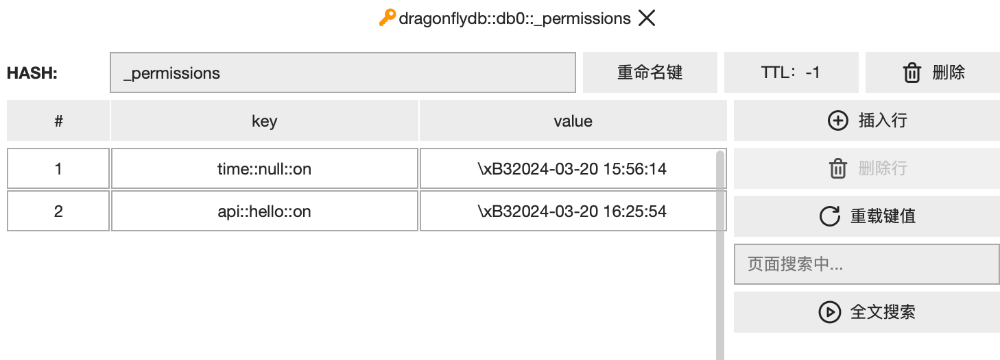

:::tip doptime 如何管理 数据权限,来确保访问安全性?
## http操作的黑白名单
:::
### 1. 什么是http操作
doptime-client 的一个http操作，定义为command 和 key 的组合
- command 就是像 hGet, hGetAll, get, set, api 等操作
- key 就是redis主键,或者是api的名称

### 2. 什么是操作的黑白名单
- `command::key::on/off` 构成了黑白名单的条目，像是api::hello::off
- doptime 并没有把黑白名单区分成两个独立的列表。而是在一个列表中，通过on/off来区分。
- 这么设计的目的是为了可以快速搜索、添加、修改黑白名单条目。（在下图的页面搜索输入框中）

### 3. 操作的黑白名单保存在哪里
- 这个黑白名单位于名称为default的redis服务器的 _permissions 主键下  
- 如果你需要添加到黑名单，那制需要添加一个诸如 api::hello::off 的条目。
  

### 4. doptime 的自动白名单授权
1. 开发服务器[变量配置为](/zh/变量配置/)： "HTTP": "\{\"AutoAuth\":true\}"时，自动授权功能开启。  
  此时，在doptime-client中执行一个http操作时，doptime会把该操作添加到白名单中。
2. 自动授权有哪些好处呢?
- 自动授权是一种零成本操作，意味着你无需额外努力，就可以准确完成配置。  
- 随着开发的进行，你的服务端会自动实现需要的数据安全性，不多也不少。
3. 你不应当在生产环境中开启自动授权功能。因为这样会导致不可预测的安全风险。
