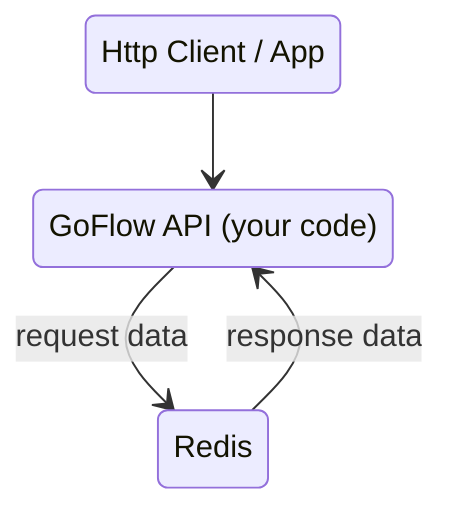

import Mermaid from '@theme/Mermaid';

:::info
## GoFlow 工作原理图，从客户端请求到服务端响应
:::
### 情形1：[GoFlow作为数据库框架](/zh/GoFlow作为数据库框架/)，直接读写Redis数据库。

### 情形2：GoFlow作为API框架+数据库框架

- 当客户端发起的请求是Redis 数据请求时，比如 HGET(key), HGETALL(key), HKEYS(key), Get(key)等，GoFlow直接向Redis请求数据，然后返回给客户端。
  
- 当客户端发起的请求是API请求时，GoFlow会调用相应的API函数，然后返回给客户端。
  

:::info
### 注：GoFlow和YourCode/Api 是在同一个进程中
- 作为单体模式使用时。有一个GoFlow进程
- 作为微服务模式使用时：
- - 有多个GoFlow进程,这些GoFlow进程都可以作为API和数据服务入口
- - 多个GoFlow进程中API可以彼此调用，通过调用这个默认Redis转发。 
:::
