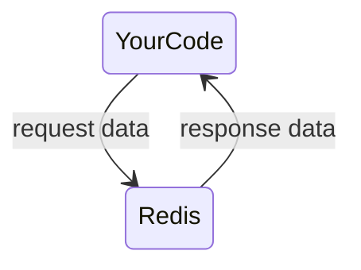
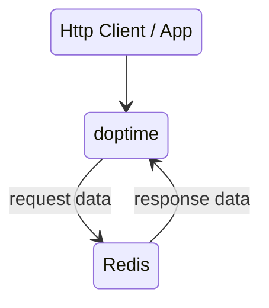

import Tabs from '@theme/Tabs';
import TabItem from '@theme/TabItem';

:::info
## doptime同样可仅作为数据库框架使用。就如同GORM那样
:::

<Tabs>
<TabItem value="在你的代码中作为数据库框架使用">

</TabItem>
<TabItem value="在web客户端中作为数据库框架使用">
- 需要设置Redis key 安全权限
- 这个权限可以在开发过程自动配置

</TabItem>
</Tabs>

:::info
### 优点
- data.Context申明后就可以直接使用
- 更加简洁。无需db.Create
- Key-Value数据库可以替代关系型数据库
:::
:::warning
### 缺点
- 无法使用SQL语句、事务等高级功能
- 如果需要高级查询意味着
- 1. 你需要使用lo,linq这样的工具
- 2. 或者你需要额外SortedSet, 等维护查询索引
:::

