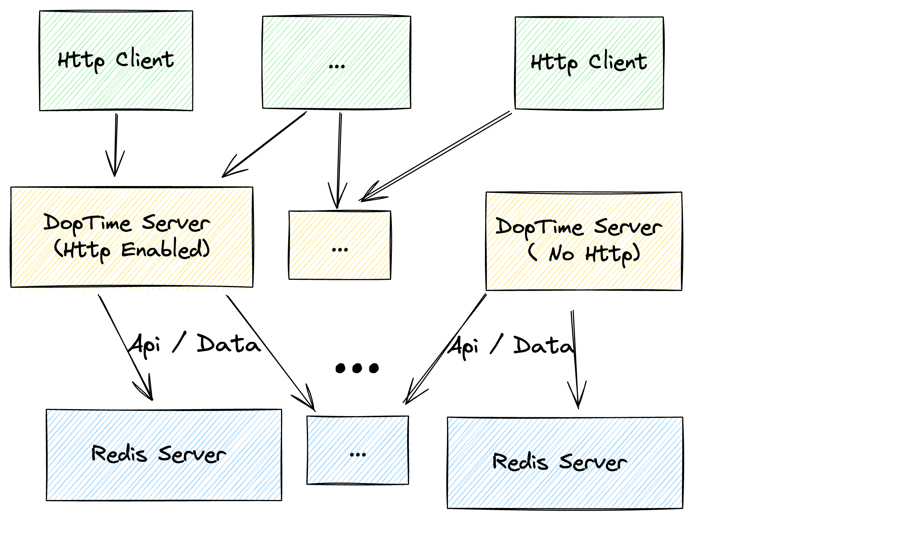

import Mermaid from '@theme/Mermaid';

:::tip 从http 到 doptime 到 redis
## doptime 后端服务交互流程图
:::

:::tip 如何理解
## 如何理解 doptime 
:::
### 1. doptime是一个后端API框架
- 在api.Api(...)中功能代码定义  
- 这个api可以响应http 请求。作为http服务端。
- 这个功能是可选的，你可以不使用http服务端。

### 2. doptime支持RPC 
- 上面创建的api函数作为RPC服务端用，不必另外定义
- 通过在api.Rpc\[inType,outType\](...)定义Rpc客户端函数，它可以调用RPC服务端。
- 这种RPC调用通过Redis转发参数
- 如果你希望使用Http直连而非redis转发，来提高效率，或是不希望暴露redis服务器，可以直接调用api.RpcOverHttp\[in,out\](Option.WithSourceHttp(...))。

### 3. 作为数据库框架
- doptime 仅使用Redis 类型的数据库，不使用其它数据库
- doptime 自带了数据操作函数。你可以通过data.New\[keyType,valueType\]()来定义数据对象。

### 4. 作为同时是单体架构和多体架构。
- 由于一个api.Api(...) 创建的函数对象可以通过http,RPC 调用。所以你用doptime写单体服务时，也已经写好了多体服务，它已经同时成为多体服务的一部分。
- 如果你要进一步拆分服务，到多个doptime进程，那也很容易。

### 5. DopTime进程的通信使用交换机模型
- doptime作为微服务时，使用交换机模型作为通信模型。我们把redis 数据库看做是一个数据交换机，doptime进程则可以拔插到redis交换机上。
- 这和传统的RPC不同。传统的微服务是点对点模型，每个微服务之间直接通过对方的IP、port 直接调用。
- 传统的RPC不依赖redis 这样的第三方端点通信。它们依赖点对点通信。这意味着更复杂的耦合（依赖性）。
- 交换机模型大大简化了拓扑结构。插入和删除一个服务，不影响其他服务。这在动态添加服务，动态添加新服务上是非常有用的。
