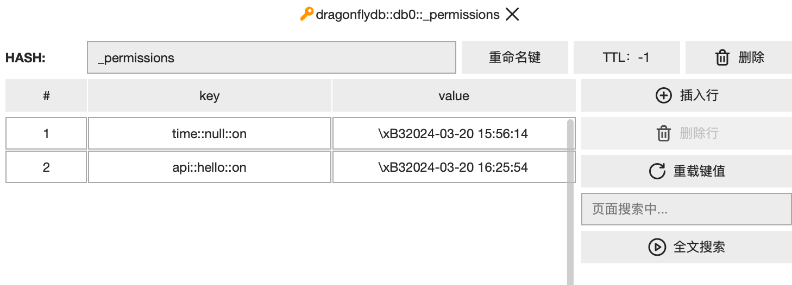

:::tip doptime 如何管理 数据安全性?
## http操作的黑白名单控制
:::
### 1. 什么是http操作
doptime-client 的一个http操作，定义为command 和 key 的组合
- command 就是像 hGet, hGetAll, get, set, api 等操作
- key 就是redis主键,或者是api的名称

### 2. 什么是操作的黑白名单
- `command::key::on/off` 构成了黑白名单的条目，像是api::hello::off
- doptime 并没有把黑白名单区分成两个独立的列表。而是在一个列表中，通过on/off来区分。
- 这么设计的目的是为了可以快速搜索、添加、修改黑白名单条目。（在下图的页面搜索输入框中）

### 3. 操作的黑白名单保存在哪里
- 这个黑白名单位于名称为default的redis服务器的 _permissions 主键下  
- 如果你需要添加到黑名单，那制需要添加一个诸如 api::hello::off 的条目。
  

### 4. doptime 的自动白名单授权
1. 开发服务器[变量配置为](/zh/变量配置/)： "HTTP": "\{\"AutoAuth\":true\}"时，自动授权功能开启。  
  此时，在doptime-client中执行一个http操作时，doptime会把该操作添加到白名单中。
2. 自动授权有哪些好处呢?
- 自动授权是一种零成本操作，意味着你无需额外努力，就可以准确完成配置。  
- 随着开发的进行，你的服务端会自动实现需要的数据安全性，不多也不少。
3. 你不应当在生产环境中开启自动授权功能。因为这样会导致不可预测的安全风险。

    
## 主键/hKey 的 碰撞安全性 和 冲突安全性
### 1. 安全风险1：碰撞安全性如何发生
- 现在，假设一个操作hget::userInfoPublic::on已被许可。
- 然后在doptime-client中使用 hget("userInfoPublic",otherUserId)来查询用户信息。
- 现在来了入侵者，随机生成了大量 otherUserId，试图通过暴力碰撞，扫描用户信息。 这种非预期查询，构成了碰撞安全隐患

### 2. 安全风险2：冲突安全性如何发生
- 有时候我们会采用用户名的哈希值作为主键来修改和查看用户信息
- 但不幸的是，两个用户的用户名哈希值有可能恰巧相同，这就导致了冲突安全隐患
- 现在用户A修改的信息会被B看到，B修改的信息会被A看到。他们似乎感觉信息被入侵篡改了
- 这种并非期望的的哈希值相同，构成了冲突安全隐患
  

##  主键/hKey 要多长才能确保安全性  
  解决 主键/哈希 的 碰撞安全性 和 冲突安全性冲突也简单，只需要主键足够长。  
  也许你很聪明，有别的方法来解决哈希值的安全风险。  
  但暴力解决方案通常总是最优，最彻底的解决方案，是就像Sutton 的 The Bitter Lesson 所指出的那样。  
  所以只需要放下我们作为人类的简洁强迫就可以，接受长的主键。  

#### 那么 主键/hKey 需要多长才能确保碰撞安全性
- 在单查询的情况下，诸如get,hget,一般认为32位哈希是碰撞安全的。
- 在批量查询模式下，诸如hmget, 一般认为64位哈希是碰撞安全的。
- 但许多情况下你并不确定你以后不会改变查询模式，所以建议使用64位哈希。
- 一般来说，64位的主键够用了。 如果你是头部互联网公司，那么96位的objectID可能是有必要的。
 
#### 注：你的hKey需要多长才能确保冲突安全性  
- 预期冲突数公司为：p(n) =1 - e^(-k*(k-1)/(2*n)).其中n是数据规模，k是key的位长。
- 无论你的数据规模如何，都不建议使用int32作为主键。建议使用int64或者是string类型。  
- 为了使32位哈希时预期冲突数为1，数据规模要小于大约92682 (16Bit)。  
- 为了使64位哈希时预期冲突数为1，数据规模要小于大约60.74亿 (32Bit)。  
- 为了使96位哈希时预期冲突数为1(mongodb 的objectid)，数据规模要小于大约398T.(48bit)   

### 主键的类型 和生成方式
#### 类型 - 建议使用string类型
- 不建议redis 主键使用int类型，像是int32、int64。
- 因为jwt不区分类型，所以它们可能会意外地被表示位float64。当它们转换成为string时，可能会出现被表示成科学计数法的情况，造成无法读取数据。
### 生成方式 建议 使用 xxhash
- doptime 最佳实践。建议使用xxhash.XXH64(key)来生成hash。
- 使用xxhash，你往往只需不需要传递hash值。而是直接在客户端计算hash值。许多时候这样是方便的。
